# OpenCloudOS 8 迁移 OpenCloudOS 9 测试报告

## 版本信息

待迁移系统版本：

| 原始镜像                          | 内核版本             | 系统版本          | 系统架构 |
| --------------------------------- | -------------------- | ----------------- | -------- |
| `OpenCloudOS-8.8-x86_64-dvd1.iso` | `5.4.119-20.0009.28` | `OpenCloudOS 8.8` | `x86_64` |

迁移仓库信息：

| 仓库标识    | 仓库地址                                                               |
| ----------- | ---------------------------------------------------------------------- |
| `BaseOS`    | `https://mirrors.opencloudos.tech/opencloudos/9/BaseOS/${ARCH}/os/`    |
| `AppStream` | `https://mirrors.opencloudos.tech/opencloudos/9/AppStream/${ARCH}/os/` |
| `Extras`    | `https://mirrors.opencloudos.tech/opencloudos/9/extras/${ARCH}/os/`    |

> ${ARCH} 是迁移工具中使用 arch 命令自动获取的运行环境架构。

## 测试范围

1. 系统可正常从 openCloudOS 8 迁移到 OpenCloudOS 9；
2. 系统迁移支持 UEFI 和 BIOS 两种安装模式；
3. 系统迁移完成之后，系统可正常关机、启动、重启；
4. 系统迁移完成之后，系统内核版本正常切换至 OpenCloudOS 9 的内核版本；
5. 系统迁移完成之后，原系统中用户信息正常可用；
6. 系统迁移完成之后，系统关键服务状态正常，如 SSHD，可正常通过 SSH client 连接；

## 测试环境

| 模式 | 虚拟化       | CPU   | 内存 | 磁盘  | 主机名    |
| ---- | ------------ | ----- | ---- | ----- | --------- |
| BIOS | vmware       | 2vCPU | 6GB  | 100GB | localhost |
| UEFI | libvirt+qemu | 2vCPU | 6GB  | 20GB  | localhost |

## 测试用例和测试脚本

执行迁移工具，使用参数 `-uU`：

```bash
bash migrate-opencloudos.sh -uU
```

> 运行说明：
>
> 1. -u 指示运行迁移工具将系统从 OpenCloudOS 8 迁移到 OpenCloudOS 9;
> 2. -U 只是迁移到 OpenCloudOS 9 之前先试用 OpenCloudOS 8 的仓库将系统升级到最新版本；
>    不使用其他参数是为了测试耗时考虑。

## 测试结果

### 老版本系统启动

使用 BIOS 模式安装的 openCloudOS 8 系统启动 grub 界面：

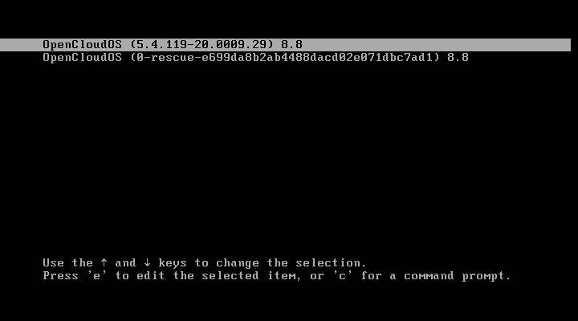

使用 UEFI 模式安装的 openCloudOS 8 系统启动 grub 界面:

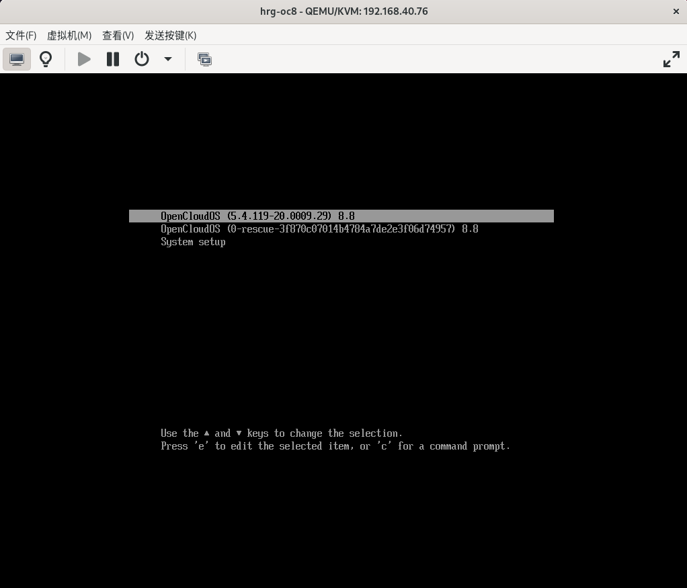

### 老版本系统检查

升级前 openCloudOS 8 系统的关于界面：


升级前 openCloudOS 8 系统包数量统计及版本信息:

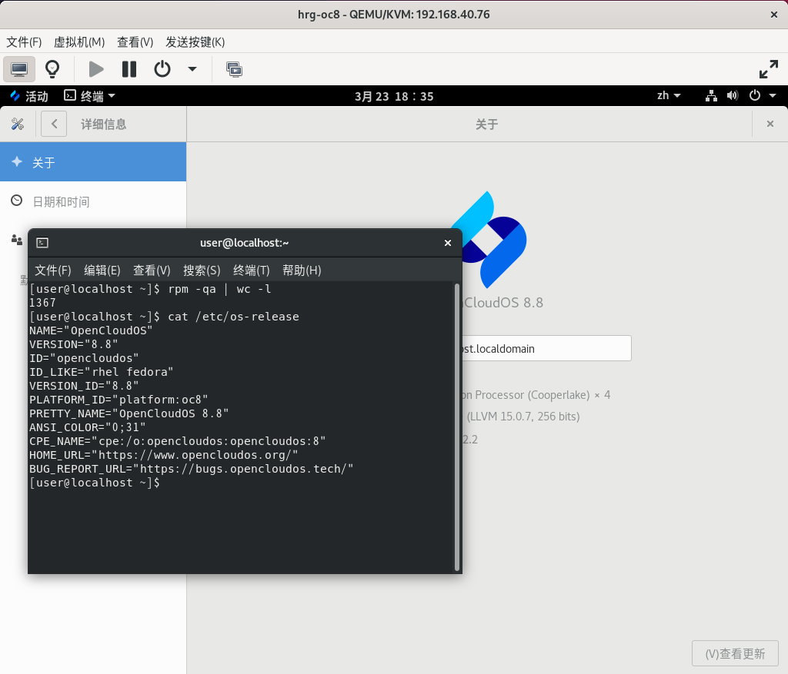

### 完成升级

系统完成升级时的屏幕输出日志及包数量统计：

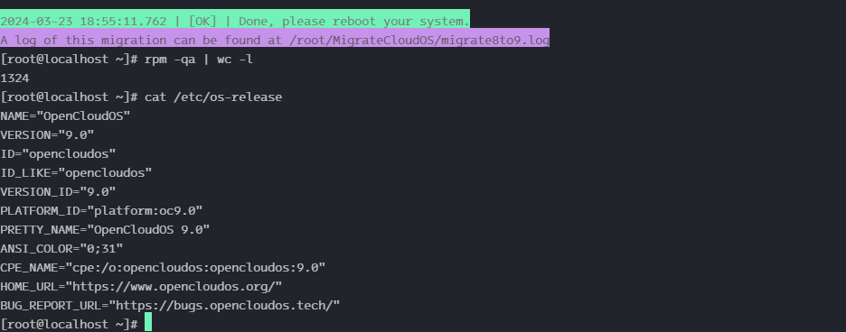

系统升级完成之后的升级日志展示（仅输出日志最后一屏信息）：

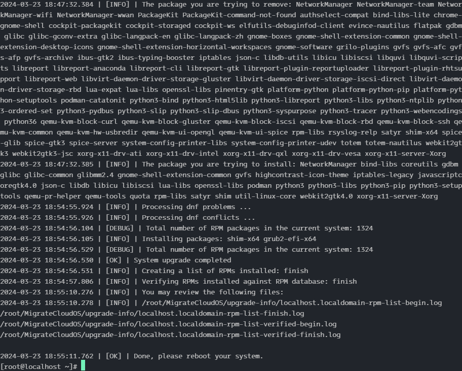

### 新版本系统启动

升级后 BIOS 模式的 openCloudOS 9 系统启动的 grub 界面：

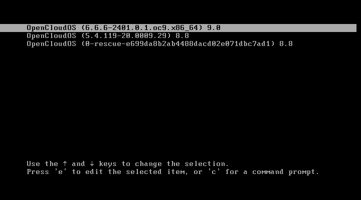

升级后 UEFI 模式的 openCloudOS 9 系统启动的 grub 界面：

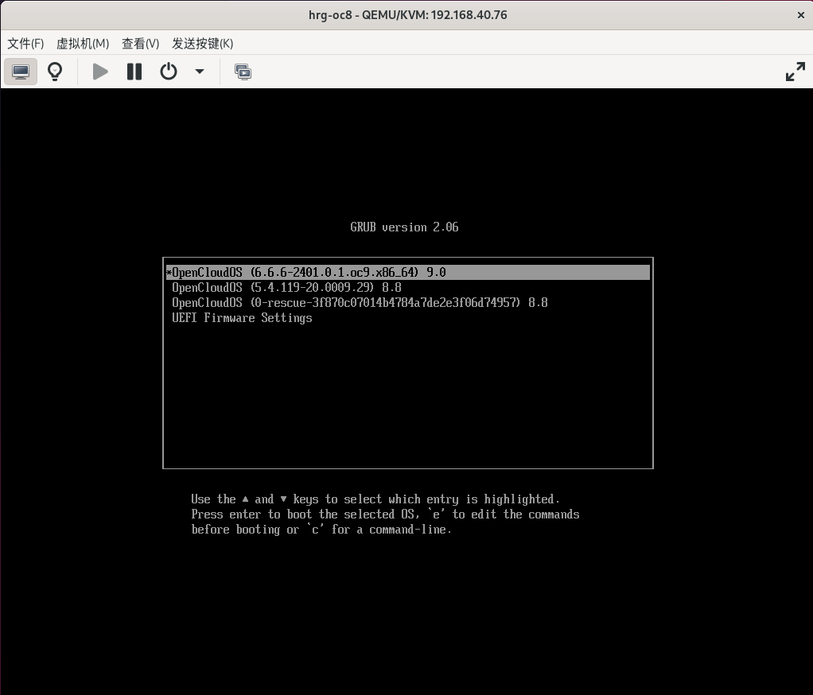

### 新版本系统检查

升级之后的系统登录首屏：


升级之后的系统关于界面：

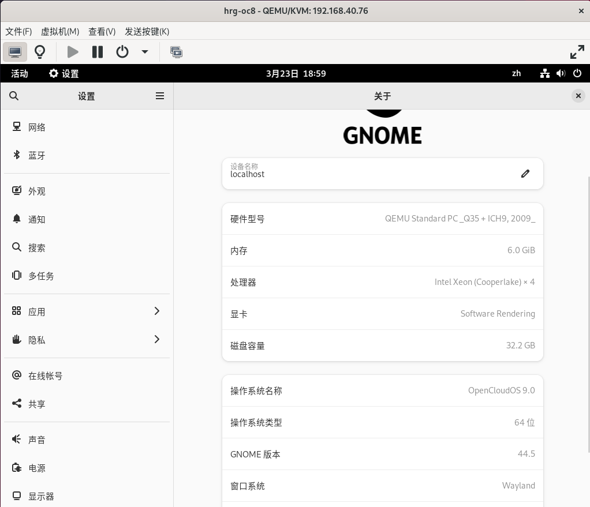

升级之后的系统包数量统计及版本信息：

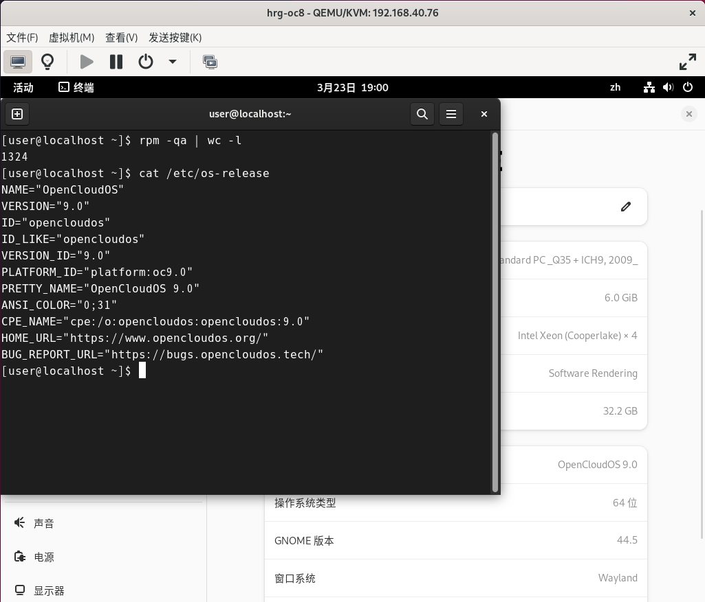

### 系统用户信息

#### 升级前

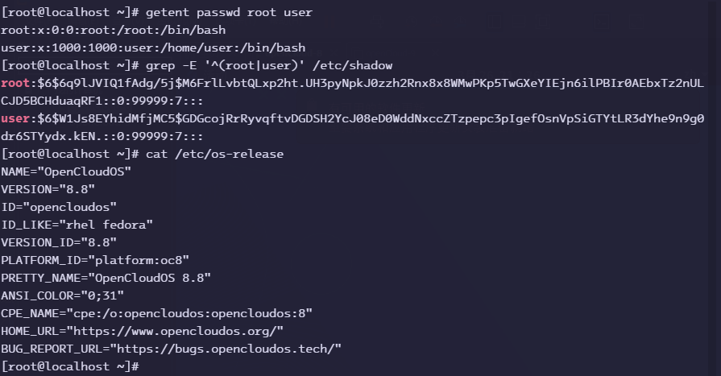

#### 升级后

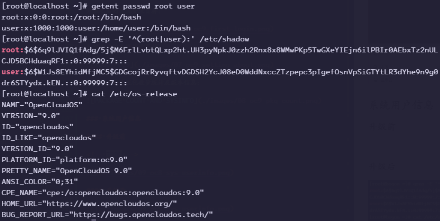

### SSH 验证

#### 升级前连接

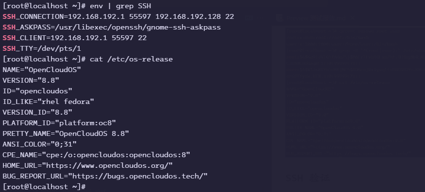

#### 升级后连接

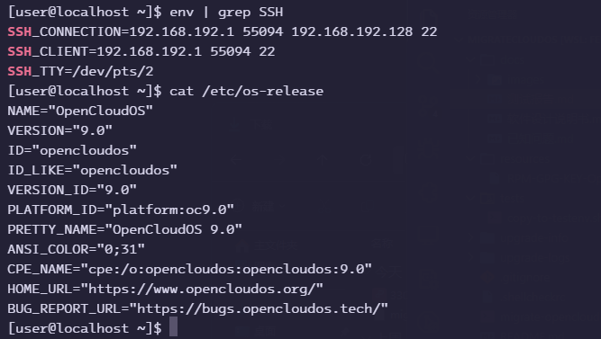
