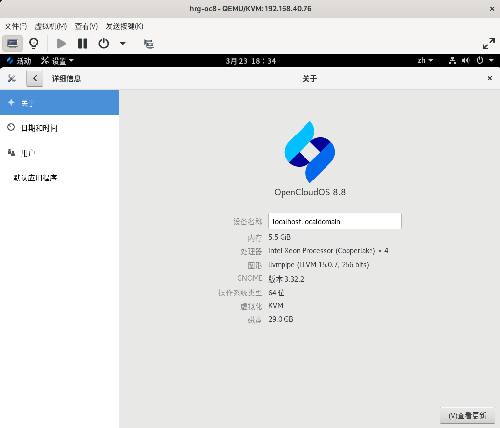

# 测试报告

## 老版本系统启动

使用 BIOS 模式安装的 openCloudOS 8 系统启动 grub 界面：

使用 UEFI 模式安装的 openCloudOS 8 系统启动 grub 界面:

## 老版本系统检查

升级前 openCloudOS 8 系统的关于界面：

升级前 openCloudOS 8 系统包数量统计及版本信息:

## 完成升级

系统完成升级时的屏幕输出日志及包数量统计：

系统升级完成之后的升级日志展示（仅输出日志最后一屏信息）：

## 新版本系统启动

升级后 BIOS 模式的 openCloudOS 9 系统启动的 grub 界面：

升级后 UEFI 模式的 openCloudOS 9 系统启动的 grub 界面：

## 新版本系统检查

升级之后的系统登录首屏：

升级之后的系统关于界面：

升级之后的系统包数量统计及版本信息：

