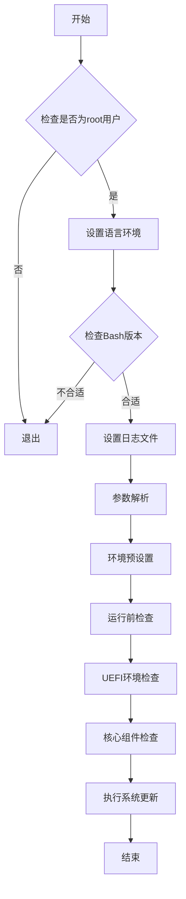
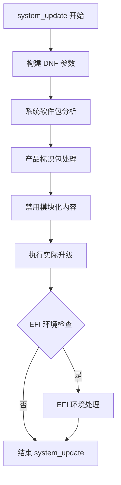
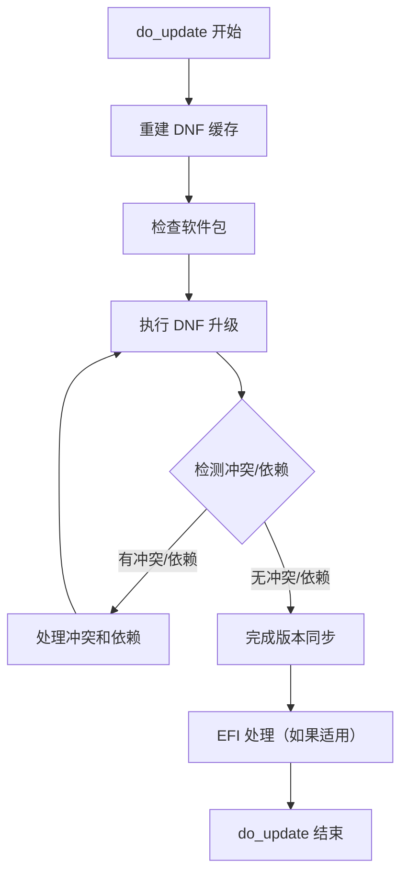

---
html:
  embed_local_images: true
  embed_svg: true
  offline: true
  toc: true

print_background: false

puppeteer:
  landscape: true
  format: "A4"
  timeout: 3000

export_on_save:
  html: false
---

# 1. 软件设计说明

## 1.1. 概述

本文档提供了 OpenCloudOS 8 至 OpenCloudOS 9 迁移升级工具的详细软件设计说明。该脚本涵盖了从环境检查到系统升级的全过程，确保了迁移的顺利进行。

## 1.2. 设计要素

以下表格总结了迁移升级工具的主要设计要素及其描述：

| 设计要素类别         | 详细内容                                         |
| -------------------- | ------------------------------------------------ |
| **环境检查与预设置** | - 确保脚本以 root 用户权限执行。                 |
| ^                    | - 设置系统 locale 为 C.UTF-8。                   |
| ^                    | - 确保脚本运行环境为 Bash 4.2 及以上版本。       |
| **日志管理**         | - 定义日志文件存储路径及名称。                   |
| ^                    | - 实现日志轮转机制。                             |
| ^                    | - 实现多级别日志记录功能。                       |
| **参数解析**         | - 解析命令行参数。                               |
| ^                    | - 提供脚本使用说明和参数选项详情。               |
| **系统信息收集**     | - 确认系统启动方式，并收集 EFI 相关信息。        |
| ^                    | - 获取系统服务、核心组件和模块化内容的当前状态。 |
| **升级准备**         | - 更新 GPG 密钥。                                |
| ^                    | - 标识需要更新或替换的系统软件包。               |
| **执行升级**         | - 通过 DNF 命令进行系统升级。                    |
| ^                    | - 同步系统软件包版本。                           |
| **EFI 环境处理**     | - 更新 GRUB 配置。                               |
| ^                    | - 更新 EFI 启动项。                              |
| **错误处理**         | - 实现错误捕获机制。                             |

## 1.3. 软件设计流程图

通过本文档的设计说明和流程图，开发和维护人员可以全面理解迁移升级工具的结构和功能，确保软件的高质量和可靠性。

## 核心设计

### system_update

`system_update` 函数是迁移升级脚本中核心的部分，主要负责将系统从 OpenCloudOS 8 升级到 OpenCloudOS 9。此函数执行多个子步骤，包括准备工作、系统升级、处理潜在问题和后续清理等

1. **构建 DNF 参数 (`build_swap_dnf_params`)**：

   - 构建与 OpenCloudOS 9 相关的 DNF 参数，包括仓库地址、GPG 密钥验证等。
   - 为后续的 `dnf` 命令执行提供正确的仓库配置和安全选项。

2. **系统软件包分析 (`analyse_installed`)**：

   - 分析当前系统安装的软件包，确定哪些包来自于已启用的仓库。
   - 分离出未知来源的包，确保这些包在升级过程中得到特别处理。

3. **产品标识包处理 (`check_provider_pkgs` 和 `swap_brand_pkg`)**：

   - 识别 OpenCloudOS 8 特有的标识包，并映射到 OpenCloudOS 9 的对应包。
   - 删除旧的标识包，并安装新的标识包，以完成系统标识的升级。

4. **禁用模块化内容 (`disable_modules`)**：

   - 禁用所有已启用的模块，防止在升级过程中出现模块依赖的问题。

5. **执行实际升级 (`do_update`)**：

   - 通过 `dnf distro-sync` 命令，根据构建的 DNF 参数和仓库配置，同步软件包到最新版本。
   - 在此过程中，处理包依赖、冲突，以及可能需要手动干预的问题。
   - 特别注意处理 `rpm` 和 `dnf` 在升级过程中可能出现的数据库迁移和兼容性调整。

6. **EFI 环境处理 (`fix_efi`)**：
   - 如果系统使用 EFI 启动，更新 GRUB 配置并确保 EFI 启动项指向正确的引导文件。
   - 处理 EFI 分区和启动管理器，确保系统能够通过新的启动配置成功引导。

### do_update

`do_update` 函数是 `system_update` 的关键部分，负责具体的升级逻辑。它涉及多个子函数调用和复杂的逻辑处理，确保系统从 OpenCloudOS 8 平稳升级到 OpenCloudOS 9。

1. **重建 DNF 缓存**：此步骤确保所有后续的 `dnf` 操作都基于最新的仓库数据，避免使用过时的信息。
2. **检查软件包**：
   - 确定需要升级的软件包。
   - 识别可能导致冲突的软件包，并准备相应的解决策略。
   - 检测需要替换或删除的软件包，以兼容新系统版本。
3. **执行 DNF 升级**：使用 DNF 的 `distro-sync` 功能，同步当前系统到目标版本的软件包状态。
4. **处理冲突和依赖**：自动或手动解决在升级过程中遇到的任何软件包冲突或依赖问题，确保系统稳定。
5. **EFI 处理**：对于 EFI 系统，更新 GRUB 配置和 EFI 启动项，确保系统可以正常启动到新的 OS 版本。

